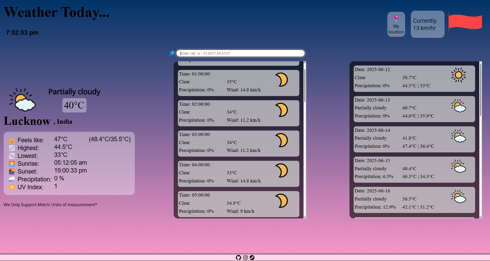

# restaurant-page

# 🍽️ Restaurant Page — Dynamic Single-Page App

A visually rich, modular restaurant website built with Webpack, ES6 modules, and clean JavaScript. The project focuses on scalable code architecture, page state management, and beautiful transitions across dynamically loaded content sections.

---

## 🌐 Live Demo

🔗 [View Site](https://44RY4N.github.io/restaurant-page/)

---

## 🖼️ Preview

 <!-- Replace with your actual path -->

---

## 🛠️ Tech Stack

- **HTML5**: Semantic markup for content structure
- **SCSS/CSS3**: Stylish transitions, modern layout, hover effects
- **JavaScript (ES6)**: DOM manipulation, dynamic tab system, modular code
- **Webpack**: Bundled for scalable development
- **JSON**: For potential content management
- **NPM**: Dependency management and build scripts

---

## 🔍 Features

- 🧱 **Modular Design**: Home, Menu, and Contact sections split via JavaScript modules
- ♻️ **Single-Page App Behavior**: Seamless transitions without full page reloads
- 🧩 **Webpack Integration**: Organized and scalable with separate config, modules, and assets
- 🎨 **Beautiful UI**: Themed layout, typography, responsive design
- 🧠 **SOLID Principles**: Code structured with future extensibility and separation of concerns

---

## 🗂️ Project Structure

restaurant-page/
├── dist/                                              
│ └── index.html                                              
│ └── main.js                                              
├── src/                                                    
│ ├── index.js                                                        
│ ├── home.js                                                
│ ├── menu.js                                          
│ ├── about.js                                                  
│ ├── template.html                                                        
│ ├── styles.css                                                      
│ └── img/                                                        
├── assets/                                                            
├── package.json                                                      
├── package.lock.json                                                    
├── webpack.config.js                                                                  
└── README.md                                                          

---

## 🧠 Lessons Learned

- Learned how to configure and use **Webpack** from scratch
- Applied **ES6 modules** for separation of content logic
- Understood **dynamic content loading** without reloads
- Maintained clean file structure and scalable development practices

---

## 🚀 Future Enhancements

- 🍕 Dynamic menu population using external JSON
- 📝 Form submission with validation and backend connection (optional)
- 🌙 Add dark mode toggle
- 🌍 Multi-language support for international visitors

---

## 🤝 Acknowledgments

This project was built as part of [The Odin Project](https://www.theodinproject.com/) curriculum for mastering JavaScript and Webpack bundling.

---

## 📬 Contact

Crafted with 🍜 by [44RY4N](https://github.com/44RY4N)  
Give it a ⭐ if you liked it or want to fork it for inspiration!
